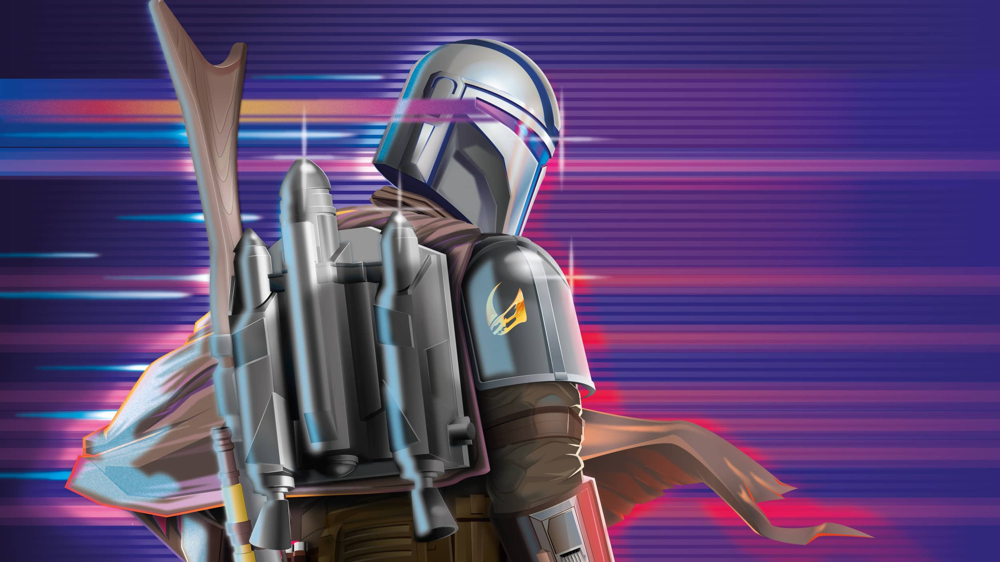

# Hi I'm Brandon.

I am a full-stack software engineer based out of the Phoenix, Arizona area. I specialize in developing software projects for web, mobile, and IoT.

***"If there's one attribute that everyone could adopt from the skateboarding community, it would be to have a desire to learn something new- to try, and fall, and pick yourself up again- and repeat that process as many times as it takes to land the trick."***

